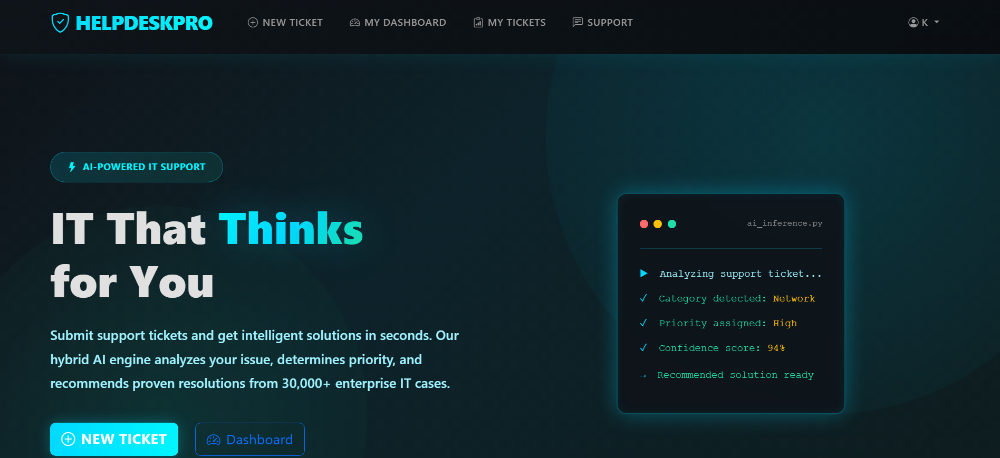
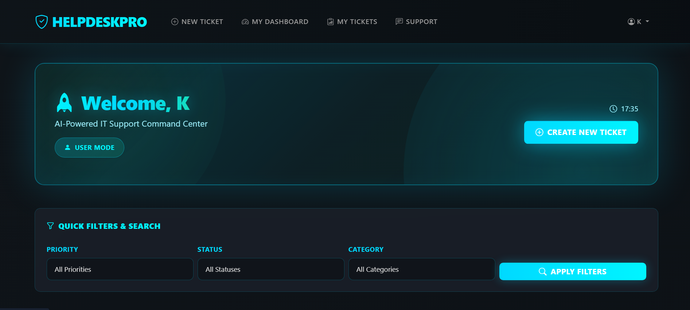
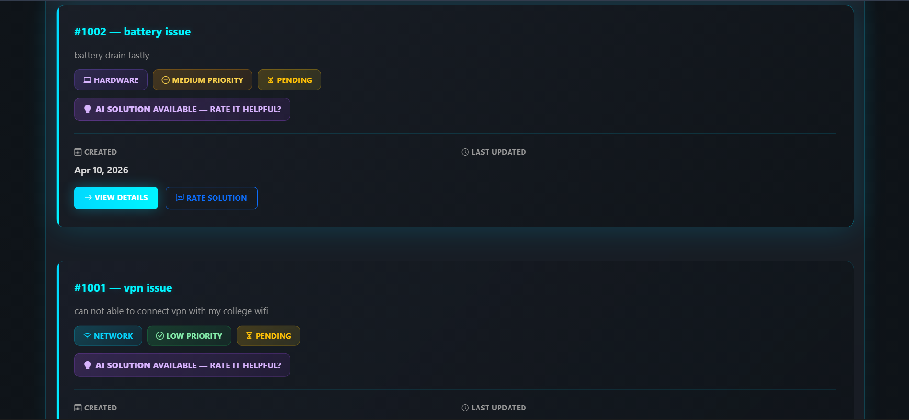
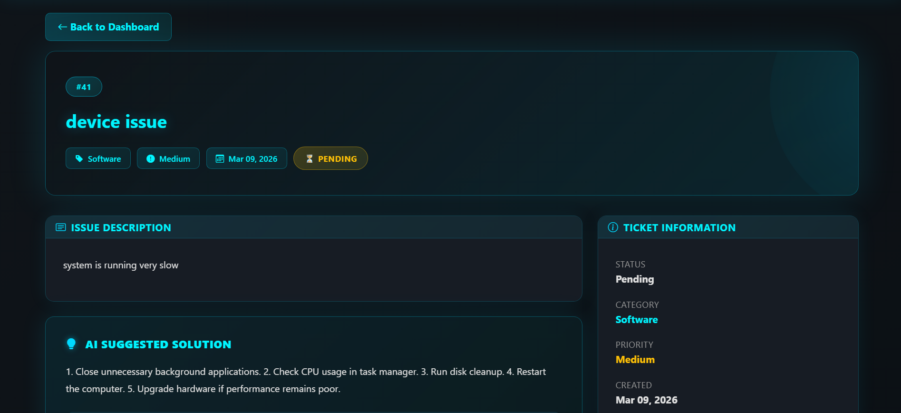
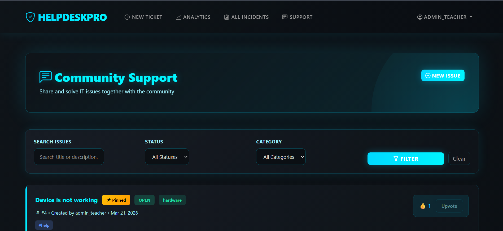

# Autonomous IT Service Desk Intelligence & Resolution Automation Platform

## Description

Autonomous IT Service Desk Intelligence & Resolution Automation Platform is a Django-based support system that automates IT ticket lifecycle management and delivers AI-driven resolution suggestions.

The platform is designed to reduce manual triage effort, improve resolution speed, and provide operational visibility for both end users and administrators.

---

## Key Highlights

- Hybrid AI pipeline for ticket understanding and solution recommendation
- Role-aware dashboards for users and administrators
- Security-focused request handling, validation, and access control
- Clean dark-themed UI tailored for modern support operations
- Built-in analytics for incident patterns and AI effectiveness

---

## Features

- User authentication system
- Ticket management system
- AI-based solution suggestions
- Admin analytics dashboard
- Support system for unresolved issues
- Error logging system
- Secure authentication and validation
- Modern UI (dark theme)

---

## Tech Stack

- Python (Django)
- Machine Learning (scikit-learn)
- HTML, CSS, Bootstrap
- SQLite

---

## System Workflow

1. User submits a ticket with issue title and description.
2. AI engine classifies the issue category and priority.
3. Similar past cases are matched for context-aware suggestions.
4. Suggested resolution is shown to the user.
5. User feedback is captured (helpful or unhelpful).
6. Unresolved cases are routed into the support workflow.
7. Admin dashboard reflects system health and performance insights.

---

## Project Structure

### config/
Core Django project settings, URL routing, WSGI/ASGI setup, and middleware configuration.

### tickets/
Ticket creation, detail view, AI feedback capture, exports, and ticket-level business logic.

### users/
Authentication, profile management, password management, and user-specific pages.

### dashboard/
User dashboard, admin analytics dashboard, incident overview, and metrics visualizations.

### ai_models/
Machine learning artifacts, vectorizers, encoders, and inference/training utilities.

### ai_engine/
Rule-based and similarity-based AI utilities for priority detection and suggestion generation.

### support/
Escalation and unresolved issue handling, support comments, and support ticket workflows.

### monitoring/
System metric simulation and anomaly-related utilities for operational observability.

### templates/
Frontend templates for all pages and components.

### docs/
Documentation assets, including project screenshots for this README.


---

## How to Run

1. Clone the repository.

```bash
git clone https://github.com/kakul-gautam/Autonomous-IT-Service-Desk-Intelligence-Resolution-Automation-Platform.git
cd Autonomous-IT-Service-Desk-Intelligence-Resolution-Automation-Platform
```

2. Create and activate a virtual environment.

```bash
python -m venv venv
```

Windows (PowerShell):

```bash
venv\Scripts\Activate.ps1
```

Linux/macOS:

```bash
source venv/bin/activate
```

3. Install dependencies.

```bash
pip install -r requirements.txt
```

4. Apply migrations.

```bash
python manage.py migrate
```

5. (Optional) Create an admin user.

```bash
python manage.py createsuperuser
```

6. Start the server.

```bash
python manage.py runserver
```

Application URL:

```text
http://127.0.0.1:8000/
```

---

## Testing

Run full test suite:

```bash
python manage.py test
```

Run specific app tests:

```bash
python manage.py test tickets
python manage.py test users
```

---

## Security Notes

- Authentication and route-level access control are enforced.
- Forms include validation and sanitization checks.
- ORM-based queries are used to avoid raw SQL risks.
- CSRF protection is enabled for POST-based forms.
- For production, set secure environment variables and disable debug mode.

---

## Screenshots

### Home Page


### Admin Dashboard


### Ticket Creation


### AI Suggestion


### Support System


---

## Future Improvements

- Improve AI accuracy
- Add notifications
- Enhance support system
- Introduce role-based alerting and SLA tracking
- Add CI pipeline for automated test and quality checks

---

## Project Goal

Build an intelligent, reliable, and secure IT service desk platform that combines automation, analytics, and AI-assisted resolution to improve operational efficiency.